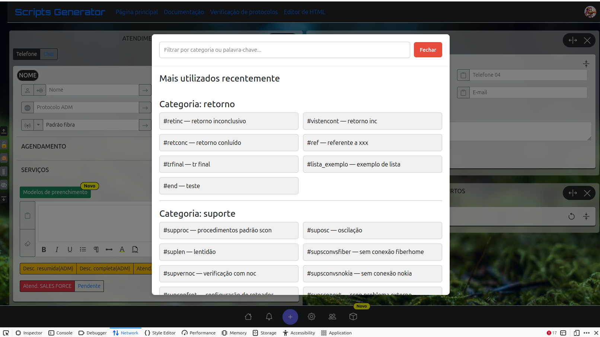
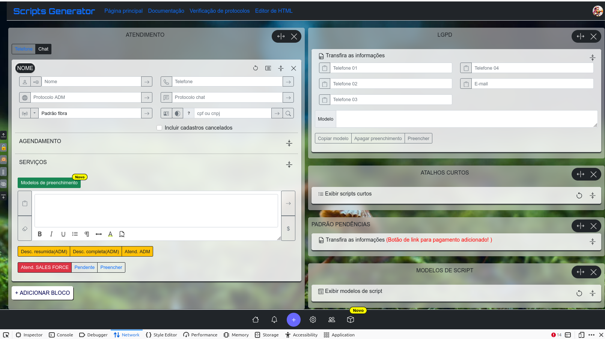

# Task Automation Platform

Uma plataforma web robusta para automação, gerenciamento de tarefas e colaboração em equipe, construída com PHP, Docker e MariaDB.

## 📋 Sobre o Projeto

Task Automation Platform é uma aplicação escalável desenvolvida em PHP que oferece:

- **Gerenciamento de Tarefas**: Criar, editar e acompanhar tarefas em tempo real
- **Automação de Processos**: Scripts e workflows automáticos para otimizar operações
- **Colaboração em Equipe**: Brainstorm, discussões e documentação compartilhada
- **Comunidade e Notificações**: Sistema de notificações e comunidades
- **Relatórios e Análises**: Geração de relatórios customizados
- **Gerenciamento de Usuários**: Autenticação, perfis e controle de acesso

## �️ Visualização

Confira abaixo duas imagens de exemplo da interface:





## �🚀 Tecnologias

- **Backend**: PHP 7.4+
- **Banco de Dados**: MariaDB 11.4.7
- **Containerização**: Docker & Docker Compose
- **Frontend**: JavaScript/Vue.js, Bootstrap 5
- **API**: RESTful (via Controllers)
- **WebSocket**: Ratchet para comunicação em tempo real
- **Email**: PHPMailer para envio de emails

## 📁 Estrutura do Projeto

```
.
├── App/
│   ├── Controllers/          # Controladores (lógica de negócio)
│   ├── Models/              # Modelos de dados
│   ├── Views/               # Templates/Views
│   └── src/                 # Recursos (imagens, etc)
├── public/                  # Arquivos públicos (CSS, JS, imagens)
│   ├── css/                # Estilos
│   ├── js/                 # Scripts JavaScript
│   ├── sass/               # Arquivos SASS
│   └── bootstrap-5.0.2-dist/ # Framework Bootstrap
├── docker/                  # Configuração Docker
│   ├── mariadb/            # Configuração do banco de dados
│   ├── php/                # Configuração do PHP
│   └── phpmyadmin/         # Configuração do phpMyAdmin
├── vendor/                  # Dependências (Composer)
├── docker-compose.yml       # Configuração dos containers
├── Dockerfile              # Imagem Docker personalizada
└── .env.example            # Exemplo de configuração (copiar para .env)
```

## 🏗️ Arquitetura

A aplicação segue o padrão **MVC (Model-View-Controller)**:

- **Models** (`App/Models/`): Lógica de dados e conexão com banco
- **Controllers** (`App/Controllers/`): Processamento de requisições
- **Views** (`App/Views/`): Templates HTML renderizados
- **Routes** (`App/Routes.php`): Mapeamento de rotas

## 🔐 Segurança

⚠️ **IMPORTANTE**: Este projeto usa variáveis de ambiente para credenciais sensíveis.

**Nunca commit dados sensíveis! Use `.env`**

```bash
# Copiar arquivo de exemplo
cp .env.example .env

# Editar com suas credenciais reais
nano .env
```

Variáveis de ambiente suportadas:

```env
# Banco de Dados - Local
DB_HOST=localhost
DB_NAME=sdev_app
DB_USER=root
DB_PASSWORD=your_password

# Banco de Dados - Third-party (InfinityFree, etc)
DB_HOST_THIRD=sql113.infinityfree.com
DB_NAME_THIRD=sdev_app
DB_USER_THIRD=username
DB_PASSWORD_THIRD=password

# Banco de Dados - Docker
DB_HOST_DOCKER=mariadb
DB_NAME_DOCKER=response_builder
DB_USER_DOCKER=root
DB_PASSWORD_DOCKER=secure_password

# Usuário da Aplicação (Docker)
DB_APP_USER=app_user
DB_APP_PASSWORD=app_password

# Email Configuration
GMAIL_USER=your_gmail@gmail.com
GMAIL_PASSWORD=your_app_password
```

**O arquivo `.env` está no `.gitignore` - NUNCA será commitado**

## 🐳 Como Usar com Docker

### Pré-requisitos

- Docker
- Docker Compose

### Instalação e Execução

```bash
# 1. Clonar o repositório
git clone <seu-repo>
cd task_automation_platform

# 2. Copiar arquivo de exemplo e configurar
cp .env.example .env

# Editar .env com as seguintes configurações para Docker:
# DB_NAME=sdev_app
# DB_PASSWORD=password123
# DB_NAME_DOCKER=sdev_app
# DB_USER_DOCKER=app_user
# DB_PASSWORD_DOCKER=app_password
# DB_APP_USER=app_user
# DB_APP_PASSWORD=app_password

# 3. Construir e iniciar containers
docker compose up --build -d

# 4. Aguardar inicialização (pode levar alguns minutos na primeira vez)

# 5. (Opcional) Importar dados do banco
./import-sql.sh seu_arquivo.sql

# 6. Acessar a aplicação
# Aplicação: http://localhost:8080
# phpMyAdmin: http://localhost:8081 (usuário: app_user, senha: app_password)
```

### Comandos Úteis

```bash
# Ver status dos containers
docker compose ps

# Ver logs da aplicação
docker compose logs -f app

# Ver logs do banco
docker compose logs -f mariadb

# Acessar shell do container PHP
docker compose exec app bash

# Parar containers
docker compose down

# Resetar (remove volumes e dados)
./reset-docker.sh

# Importar arquivo SQL
./import-sql.sh arquivo.sql

# Recriar container (se alterar .env)
docker compose up -d --force-recreate app
```
```

## 💻 Como Usar Localmente (sem Docker)

### Pré-requisitos

- PHP 7.4+
- MariaDB/MySQL
- Composer

### Instalação

```bash
# 1. Instalar dependências
composer install

# 2. Configurar ambiente
cp .env.example .env
nano .env  # Editar com suas credenciais locais

# 3. Criar banco de dados
mysql -u root < schema.sql

# 4. Configurar servidor web (Apache/Nginx)
# Apontar para diretório public/

# 5. Executar aplicação
php -S localhost:8000 -t public/
```

## 📦 Dependências Principais

```json
{
  "cboden/ratchet": "v0.4.*",
  "phpmailer/phpmailer": "^6.5",
  "Symfony": "PSR compatible"
}
```

Instalar mais dependências:

```bash
docker-compose exec app composer require vendor/package
```

## 🔄 Fluxo de Dados

```
Requisição HTTP
    ↓
Routes.php (Rota)
    ↓
Controller (processamento)
    ↓
Model (banco de dados)
    ↓
View (template HTML)
    ↓
Resposta HTTP
```

## 📚 Principais Controllers

| Controller | Função |
|-----------|---------|
| `AuthController` | Autenticação e login |
| `AppController` | Lógica geral da aplicação |
| `PlatformCommunityController` | Comunidades e grupos |
| `PlatformNotificationsController` | Notificações |
| `PlatformTeamsController` | Gerenciamento de equipes |
| `MessageController` | Sistema de mensagens |
| `RelatoioController` | Geração de relatórios |
| `WebSocketController` | Comunicação em tempo real |

## 🎨 Frontend

- **Bootstrap 5**: Framework CSS responsivo
- **Vue.js**: Componentes interativos
- **SASS**: Estilos pré-processados
- **JavaScript vanilla**: Lógica do cliente

Arquivos principais:
- `public/js/app.js` - Aplicação principal
- `public/js/Community.js` - Lógica de comunidade
- `public/js/Message.js` - Sistema de mensagens

## 📧 Email

O sistema usa **PHPMailer** para envio de emails.

Configurar em `App/Models/mail.default.php`:

```php
'host' => 'smtp.seuservidor.com',
'port' => 587,
'user' => 'seu_email@exemplo.com',
'password' => 'sua_senha',
```

## 🔔 WebSocket

Servidor WebSocket rodando em port `9001` (configurável).

Classes principais:
- `WebSocketController` - Controlador principal
- Usa Ratchet para gerenciar conexões

## 📊 Banco de Dados

MariaDB 11.4.7 com as seguintes características:

- Charset: `utf8mb4` (suporte completo a Unicode)
- Pool de conexões otimizado
- Backups automáticos em `docker/mariadb/init/`

Acessar via phpMyAdmin:
- URL: `http://localhost:8081`
- Usuário: root (ou conforme `.env`)
- Senha: (conforme `.env`)

## 🚨 Troubleshooting

### Erro de conexão ao banco

```bash
# Verificar se container está rodando
docker-compose ps

# Ver logs
docker-compose logs mariadb

# Aguardar inicialização (pode levar minutos)
sleep 30 && docker-compose ps
```

### Porta já em uso

```bash
# Mudar portas em docker-compose.yml
ports:
  - "8082:80"  # Mudar 8080 para 8082
```

### Permissões de arquivo

```bash
# Corrigir permissões
docker-compose exec app chmod -R 755 /var/www/html
docker-compose exec app chown -R www-data:www-data /var/www/html
```

## 🔐 Práticas de Segurança

✅ **Implementado:**
- Senhas em variáveis de ambiente (não hardcoded)
- Criptografia de dados sensíveis
- Prepared statements (proteção SQL Injection)
- Validação de entrada
- `.env` no `.gitignore`

⚠️ **Recomendado para produção:**
- HTTPS/SSL obrigatório
- Rate limiting
- Autenticação 2FA
- WAF (Web Application Firewall)
- Monitoramento de segurança
- Backups regulares

## 📝 Histórico de Segurança

⚠️ **AVISO**: Este repositório teve senhas hardcoded anteriormente.
As credenciais foram removidas e substituídas por variáveis de ambiente.

Se você clonou antes dessa mudança, veja [Removendo Senhas do Git](#removendo-senhas-do-git).

## 🧹 Removendo Senhas do Git

Se as senhas ainda existem no histórico, use:

```bash
# Método 1: BFG Repo-Cleaner (recomendado)
brew install bfg
echo 'sua_senha_comprometida' > passwords.txt
bfg --replace-text passwords.txt
git reflog expire --expire=now --all && git gc --prune=now --aggressive

# Método 2: git filter-branch
git filter-branch --tree-filter 'find . -type f -name "*.php" -exec sed -i "s/sua_senha/REMOVED/g" {} \;' HEAD~50..HEAD

# Fazer force push (cuidado!)
git push origin --force --all
```

## 📄 Licença

[Adicionar sua licença aqui]

## 👥 Contribuição

Antes de contribuir, certifique-se de:

1. Nunca commitar credenciais
2. Usar `.env` para dados sensíveis
3. Seguir o padrão MVC
4. Adicionar validação para entrada de usuário
5. Documentar mudanças principais

## 📞 Suporte

Para problemas ou dúvidas:

1. Verificar logs: `docker-compose logs -f`
2. Consultar seção Troubleshooting
3. Verificar configuração do `.env`

## 🎯 Roadmap

- [ ] Testes automatizados
- [ ] CI/CD Pipeline
- [ ] API GraphQL
- [ ] Mobile App
- [ ] Escalabilidade (micro-serviços)
- [ ] Autenticação OAuth2
- [ ] Dashboard avançado

---

**Desenvolvido com ❤️**

Última atualização: Abril 2026
